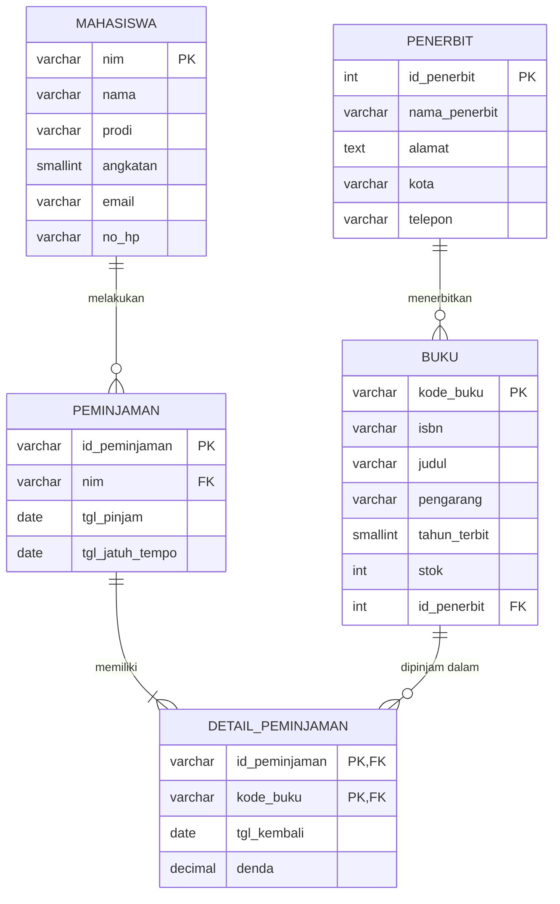

# Tugas Mandiri – Perancangan ERD E-Library Kampus

| | |
|---|---|
| **Nama** | _Aulia Dwinatasha Lubis_ |
| **NIM** | _D121241050_ |
| **Modul** | 06 – Pemodelan Database |

---


## 1. Skenario

Perpustakaan kampus membutuhkan basis data relasional untuk mengelola peminjaman buku. Sistem harus mencatat:

- data **mahasiswa** yang meminjam,
- data **buku** beserta **penerbitnya**,
- riwayat **peminjaman dan pengembalian** buku.

**Aturan bisnis yang digunakan:**

1. Satu mahasiswa dapat melakukan banyak transaksi peminjaman.
2. Satu transaksi peminjaman dapat memuat lebih dari satu buku.
3. Satu buku dapat dipinjam berkali-kali pada transaksi yang berbeda.
4. Satu penerbit dapat menerbitkan banyak buku, sedangkan satu buku hanya memiliki satu penerbit.
5. Tanggal pengembalian dan denda dicatat **per buku** karena buku dalam satu transaksi bisa dikembalikan pada waktu berbeda.

---

## 2. Identifikasi Entitas dan Atribut

| Entitas | Atribut | Primary Key | Foreign Key |
|---|---|---|---|
| **Mahasiswa** | nim, nama, prodi, angkatan, email, no_hp | nim | – |
| **Penerbit** | id_penerbit, nama_penerbit, alamat, kota, telepon | id_penerbit | – |
| **Buku** | kode_buku, isbn, judul, pengarang, tahun_terbit, stok, id_penerbit | kode_buku | id_penerbit → Penerbit |
| **Peminjaman** (Transaksi) | id_peminjaman, nim, tgl_pinjam, tgl_jatuh_tempo | id_peminjaman | nim → Mahasiswa |
| **Detail_Peminjaman** | id_peminjaman, kode_buku, tgl_kembali, denda | (id_peminjaman, kode_buku) | id_peminjaman → Peminjaman, kode_buku → Buku |

> **Catatan:** Hubungan antara Peminjaman dan Buku adalah **many-to-many**. Agar dapat diimplementasikan pada basis data relasional, hubungan ini dipecah menjadi tabel penghubung **Detail_Peminjaman**. Tabel ini muncul secara alami pada tahap normalisasi di bawah.

---

## 3. Simulasi Normalisasi

### 3.1 Bentuk Tidak Normal (UNF)

Seluruh data dicatat dalam satu relasi datar. Kolom buku berisi **kelompok berulang** (repeating group) karena satu transaksi bisa memuat beberapa buku.

**UNF** = `Peminjaman (id_peminjaman, tgl_pinjam, tgl_jatuh_tempo, nim, nama_mhs, prodi, angkatan, email, no_hp, { kode_buku, isbn, judul, pengarang, tahun_terbit, stok, id_penerbit, nama_penerbit, alamat_penerbit, kota_penerbit, telp_penerbit, tgl_kembali, denda })`

Tanda `{ ... }` menandakan kelompok atribut yang berulang.

**Contoh data UNF:**

| id_peminjaman | tgl_pinjam | tgl_jatuh_tempo | nim | nama_mhs | prodi | buku yang dipinjam (berulang) |
|---|---|---|---|---|---|---|
| P001 | 2025-09-01 | 2025-09-08 | 2310001 | Andi Saputra | Informatika | B001 – Basis Data (Pearson, Jakarta, kembali 2025-09-06, denda 0)<br>B002 – Algoritma (Informatika Press, Bandung, kembali 2025-09-10, denda 4000) |
| P002 | 2025-09-03 | 2025-09-10 | 2310002 | Siti Rahma | Sistem Informasi | B001 – Basis Data (Pearson, Jakarta, kembali 2025-09-09, denda 0) |

**Masalah UNF:** sel berisi banyak nilai (tidak atomik), sehingga sulit dicari, diurutkan, dan diperbarui.

---

### 3.2 Bentuk Normal Pertama (1NF)

**Syarat 1NF:** setiap atribut bernilai atomik dan tidak ada kelompok berulang.

**Tindakan:** kelompok berulang dipecah menjadi baris tersendiri, dengan data transaksi diulang pada setiap baris. Primary key menjadi komposit `(id_peminjaman, kode_buku)`.

**1NF** = `Peminjaman (`<u>id_peminjaman</u>`, `<u>kode_buku</u>`, tgl_pinjam, tgl_jatuh_tempo, nim, nama_mhs, prodi, angkatan, email, no_hp, isbn, judul, pengarang, tahun_terbit, stok, id_penerbit, nama_penerbit, alamat_penerbit, kota_penerbit, telp_penerbit, tgl_kembali, denda)`

| id_peminjaman | kode_buku | tgl_pinjam | nim | nama_mhs | judul | id_penerbit | nama_penerbit | tgl_kembali | denda |
|---|---|---|---|---|---|---|---|---|---|
| P001 | B001 | 2025-09-01 | 2310001 | Andi Saputra | Basis Data | 1 | Pearson | 2025-09-06 | 0 |
| P001 | B002 | 2025-09-01 | 2310001 | Andi Saputra | Algoritma | 2 | Informatika Press | 2025-09-10 | 4000 |
| P002 | B001 | 2025-09-03 | 2310002 | Siti Rahma | Basis Data | 1 | Pearson | 2025-09-09 | 0 |

**Masalah 1NF:** terjadi redundansi. Data Andi Saputra dan judul "Basis Data" tersimpan berulang. Penyebabnya adalah **ketergantungan parsial** terhadap sebagian primary key.

---

### 3.3 Bentuk Normal Kedua (2NF)

**Syarat 2NF:** sudah 1NF dan tidak ada ketergantungan parsial, yaitu atribut non-kunci harus bergantung pada **seluruh** primary key.

**Analisis ketergantungan fungsional** (PK = `id_peminjaman, kode_buku`):

| Dependensi | Jenis |
|---|---|
| `id_peminjaman → tgl_pinjam, tgl_jatuh_tempo, nim, nama_mhs, prodi, angkatan, email, no_hp` | Parsial (hanya bergantung pada sebagian PK) |
| `kode_buku → isbn, judul, pengarang, tahun_terbit, stok, id_penerbit, nama_penerbit, alamat_penerbit, kota_penerbit, telp_penerbit` | Parsial (hanya bergantung pada sebagian PK) |
| `id_peminjaman, kode_buku → tgl_kembali, denda` | Penuh (bergantung pada seluruh PK) |

**Tindakan:** pisahkan menjadi tiga relasi berdasarkan determinannya.

```
Peminjaman        (id_peminjaman, tgl_pinjam, tgl_jatuh_tempo, nim, nama_mhs, prodi, angkatan, email, no_hp)
Buku              (kode_buku, isbn, judul, pengarang, tahun_terbit, stok, id_penerbit, nama_penerbit, alamat_penerbit, kota_penerbit, telp_penerbit)
Detail_Peminjaman (id_peminjaman, kode_buku, tgl_kembali, denda)
```

**Masalah 2NF:** masih ada **ketergantungan transitif**.
- Pada `Peminjaman`: `id_peminjaman → nim → nama_mhs, prodi, ...`
- Pada `Buku`: `kode_buku → id_penerbit → nama_penerbit, alamat_penerbit, ...`

---

### 3.4 Bentuk Normal Ketiga (3NF)

**Syarat 3NF:** sudah 2NF dan tidak ada ketergantungan transitif, yaitu atribut non-kunci tidak boleh bergantung pada atribut non-kunci lain.

**Tindakan:** pisahkan atribut yang bergantung pada `nim` menjadi tabel **Mahasiswa**, dan atribut yang bergantung pada `id_penerbit` menjadi tabel **Penerbit**.

**Hasil akhir 3NF:**

```
Mahasiswa         (nim, nama, prodi, angkatan, email, no_hp)
Penerbit          (id_penerbit, nama_penerbit, alamat, kota, telepon)
Buku              (kode_buku, isbn, judul, pengarang, tahun_terbit, stok, #id_penerbit)
Peminjaman        (id_peminjaman, #nim, tgl_pinjam, tgl_jatuh_tempo)
Detail_Peminjaman (#id_peminjaman, #kode_buku, tgl_kembali, denda)
```

Tanda `#` menandakan foreign key.

**Ringkasan tahapan:**

| Tahap | Masalah yang diselesaikan | Hasil |
|---|---|---|
| UNF → 1NF | Kelompok berulang dan nilai tidak atomik | 1 relasi dengan PK komposit |
| 1NF → 2NF | Ketergantungan parsial | 3 relasi |
| 2NF → 3NF | Ketergantungan transitif | 5 relasi |

---

## 4. Rancangan Tabel Akhir

### 4.1 Tabel `mahasiswa`

| Kolom | Tipe Data | Kunci | Constraint | Keterangan |
|---|---|---|---|---|
| nim | VARCHAR(15) | PK | NOT NULL | Nomor induk mahasiswa |
| nama | VARCHAR(100) | | NOT NULL | Nama lengkap |
| prodi | VARCHAR(50) | | NOT NULL | Program studi |
| angkatan | SMALLINT | | NOT NULL | Tahun masuk |
| email | VARCHAR(100) | | UNIQUE | Alamat email |
| no_hp | VARCHAR(15) | | NULL | Nomor telepon |

### 4.2 Tabel `penerbit`

| Kolom | Tipe Data | Kunci | Constraint | Keterangan |
|---|---|---|---|---|
| id_penerbit | INT | PK | AUTO_INCREMENT, NOT NULL | ID penerbit |
| nama_penerbit | VARCHAR(100) | | NOT NULL | Nama penerbit |
| alamat | TEXT | | NULL | Alamat penerbit |
| kota | VARCHAR(50) | | NULL | Kota penerbit |
| telepon | VARCHAR(15) | | NULL | Nomor telepon penerbit |

### 4.3 Tabel `buku`

| Kolom | Tipe Data | Kunci | Constraint | Keterangan |
|---|---|---|---|---|
| kode_buku | VARCHAR(10) | PK | NOT NULL | Kode unik buku |
| isbn | VARCHAR(20) | | UNIQUE | Nomor ISBN |
| judul | VARCHAR(200) | | NOT NULL | Judul buku |
| pengarang | VARCHAR(100) | | NOT NULL | Nama pengarang |
| tahun_terbit | SMALLINT | | NOT NULL | Tahun terbit |
| stok | INT | | NOT NULL, DEFAULT 0 | Jumlah eksemplar tersedia |
| id_penerbit | INT | FK | NOT NULL | Mengacu ke `penerbit.id_penerbit` |

### 4.4 Tabel `peminjaman`

| Kolom | Tipe Data | Kunci | Constraint | Keterangan |
|---|---|---|---|---|
| id_peminjaman | VARCHAR(12) | PK | NOT NULL | ID transaksi (contoh: P001) |
| nim | VARCHAR(15) | FK | NOT NULL | Mengacu ke `mahasiswa.nim` |
| tgl_pinjam | DATE | | NOT NULL | Tanggal peminjaman |
| tgl_jatuh_tempo | DATE | | NOT NULL | Batas waktu pengembalian |

### 4.5 Tabel `detail_peminjaman`

| Kolom | Tipe Data | Kunci | Constraint | Keterangan |
|---|---|---|---|---|
| id_peminjaman | VARCHAR(12) | PK, FK | NOT NULL | Mengacu ke `peminjaman.id_peminjaman` |
| kode_buku | VARCHAR(10) | PK, FK | NOT NULL | Mengacu ke `buku.kode_buku` |
| tgl_kembali | DATE | | NULL | Kosong jika belum dikembalikan |
| denda | DECIMAL(10,2) | | NOT NULL, DEFAULT 0 | Denda keterlambatan |

> Status peminjaman tidak disimpan sebagai kolom tersendiri. Buku dianggap **masih dipinjam** jika `tgl_kembali` bernilai NULL. Ini menghindari data turunan yang bisa tidak sinkron.

---

## 5. Diagram Relasi (ERD)



**Penjelasan kardinalitas:**

| Relasi | Kardinalitas | Penjelasan |
|---|---|---|
| Penerbit – Buku | 1 : N | Satu penerbit menerbitkan banyak buku, satu buku punya satu penerbit |
| Mahasiswa – Peminjaman | 1 : N | Satu mahasiswa dapat melakukan banyak transaksi |
| Peminjaman – Detail_Peminjaman | 1 : N | Satu transaksi memuat minimal satu buku |
| Buku – Detail_Peminjaman | 1 : N | Satu buku dapat muncul di banyak transaksi |
| Peminjaman – Buku (melalui detail) | M : N | Dipecah dengan tabel `detail_peminjaman` |

### Diagram alur kunci (teks)

```
PENERBIT.id_penerbit ──(PK→FK)──> BUKU.id_penerbit
BUKU.kode_buku       ──(PK→FK)──> DETAIL_PEMINJAMAN.kode_buku
MAHASISWA.nim        ──(PK→FK)──> PEMINJAMAN.nim
PEMINJAMAN.id_peminjaman ─(PK→FK)─> DETAIL_PEMINJAMAN.id_peminjaman
```

---

## 6. Implementasi SQL (DDL)

```sql
CREATE TABLE mahasiswa (
    nim       VARCHAR(15)  PRIMARY KEY,
    nama      VARCHAR(100) NOT NULL,
    prodi     VARCHAR(50)  NOT NULL,
    angkatan  SMALLINT     NOT NULL,
    email     VARCHAR(100) UNIQUE,
    no_hp     VARCHAR(15)
);

CREATE TABLE penerbit (
    id_penerbit    INT AUTO_INCREMENT PRIMARY KEY,
    nama_penerbit  VARCHAR(100) NOT NULL,
    alamat         TEXT,
    kota           VARCHAR(50),
    telepon        VARCHAR(15)
);

CREATE TABLE buku (
    kode_buku     VARCHAR(10)  PRIMARY KEY,
    isbn          VARCHAR(20)  UNIQUE,
    judul         VARCHAR(200) NOT NULL,
    pengarang     VARCHAR(100) NOT NULL,
    tahun_terbit  SMALLINT     NOT NULL,
    stok          INT          NOT NULL DEFAULT 0,
    id_penerbit   INT          NOT NULL,
    FOREIGN KEY (id_penerbit) REFERENCES penerbit(id_penerbit)
);

CREATE TABLE peminjaman (
    id_peminjaman    VARCHAR(12) PRIMARY KEY,
    nim              VARCHAR(15) NOT NULL,
    tgl_pinjam       DATE        NOT NULL,
    tgl_jatuh_tempo  DATE        NOT NULL,
    FOREIGN KEY (nim) REFERENCES mahasiswa(nim)
);

CREATE TABLE detail_peminjaman (
    id_peminjaman  VARCHAR(12) NOT NULL,
    kode_buku      VARCHAR(10) NOT NULL,
    tgl_kembali    DATE,
    denda          DECIMAL(10,2) NOT NULL DEFAULT 0,
    PRIMARY KEY (id_peminjaman, kode_buku),
    FOREIGN KEY (id_peminjaman) REFERENCES peminjaman(id_peminjaman),
    FOREIGN KEY (kode_buku)     REFERENCES buku(kode_buku)
);
```

---

## 7. Kesimpulan

Dari satu relasi tidak normal, proses normalisasi menghasilkan **lima tabel** pada 3NF: `mahasiswa`, `penerbit`, `buku`, `peminjaman`, dan `detail_peminjaman`. Rancangan ini menghilangkan redundansi, mencegah anomali pada operasi tambah, ubah, dan hapus, serta menjaga konsistensi data lewat primary key dan foreign key.
